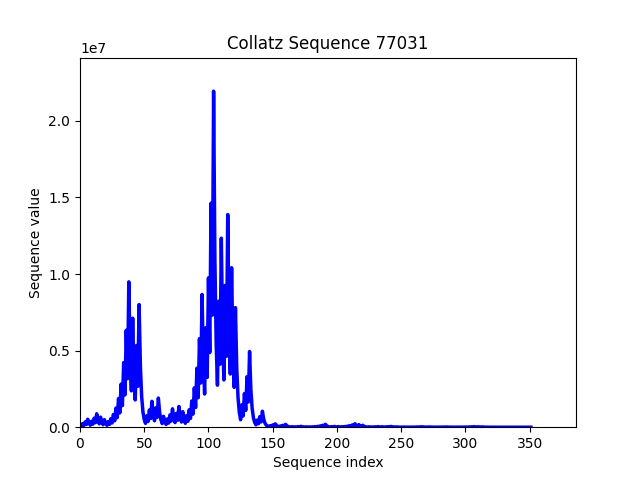

<h1>The Collatz Conjecture</h1>
The Collatz Conjecture is named after Lothar Collatz, who introduced the idea in 1937. The conjecture is about sequences obtained from any positive integer.  

Starting with any positive integer n as the first value of the sequence, if the integer is even, take the next value in the sequence to be n/2; otherwise take the next value to be 3 * n + 1. For example, with n = 12 we have 12, 6, 3, 10, 5, 16, 8, 4, 2, 1, ...

The conjecture is that for every positive integer n, the sequence so defined above eventually has the number 1 as a value. 



For positive integer n, if we say the sequence is S(0), S(1), S(2), ...  then the smallest i such that S(i) = 1 is called the total stopping time of n. I define collatz(n) to be that stopping time of n. So that collatz() is a total function on the domain N, define collatz(n) to be -1 if there is no such i; i.e. the sequence fails to have any term that is 1.

Let N be the natural numbers, and N+ be the positive integers.  
Define f: N+ -> N as  
f(n) = n/2, if n is even, while 3 * n + 1, if n is odd  

For n in N+, define sequence S: N -> N as  
S(i) = n, if i = 0, while f(S(i-1)), if i > 0  

Hence S(i) is the value of f applied to n recursively i times.  

Define collatz:N+ -> N union {-1} as  
collatz(n) = the smallest i such that S(i) = 1, if there is such an i, and S(i) = -1 if no such i.

NB: An Intuitionist mathematician might not accept that collatz() so defined above is a total function on N+. 95% of mathematician would say it is a total function. They would say that it is a total function because either the sequence has 1 as a term, or it doesn't. However, the Intuitionist will not accept De Morgan's law applied to an infinite set; here the positive integers, unless there is a proof. As the following Wikipedia page says:

>Similarly, to assert that A or B holds, to an intuitionist, is to claim that either A or B can be proved. In particular, the law of excluded middle, "A or not A", is not accepted as a valid principle. For example, if A is some mathematical statement that an intuitionist has not yet proved or disproved, then that intuitionist will not assert the truth of "A or not A". However, the intuitionist will accept that "A and not A" cannot be true. Thus, the connectives "and" and "or" of intuitionist logic do not satisfy de Morgan's laws as they do in classical logic.  
>
See: https://en.wikipedia.org/wiki/Intuitionism  

See: https://en.wikipedia.org/wiki/Collatz_conjecture  

<h2>Usage</h2>

````
usage: collatz.py [-h] n

Computes collatz(n)

positional arguments:
  n           argument of collatz function

optional arguments:
  -h, --help  show this help message and exit
````
